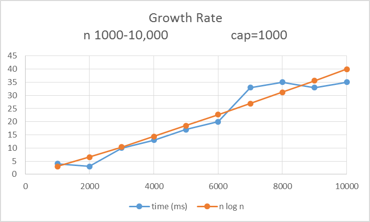

Fractional Knapsack Investigation
=================================

## John Harvey

### About
The Fractional Knapsack algorithm implemented in Ruby. 

### Install Notes - Ubuntu
1. Clone repo with git `git clone https://github.com/jharvey7136/fractional_knapsack.git`
2. Navigate to the app's root directory through the terminal
3. Run program with command: `ruby Knapsack.rb`

### Hypothesis
The Fractional Knapsack algorithm has a time complexity of O(n logn).

### Test Design
In order to test the hypothesis involved, I have taken the following steps:

1. Implement the FractionalKnapsack algorithm in Ruby
2. Run the code for multiple amounts of n items
  * Test with various maximum capacities
  * Analyze all data on individual graphs
  * Analyze all data on a single graph
3. Inspect the graphs and compare the growth to an n log n growth rate
4. Examine code and make changes if results do not seem right

### Visual Inspection

John Harvey

Due: 4/9/17

implementation is in Knapsack.rb

data can be found in the data.csv's

Spreadsheet is an excel file composed of all the
generated data and plots

to run program-

ruby Knapsack.rb

to change values-

visit line 44 in Knapsack.rb

RESOURCES:
http://www.personal.kent.edu/~rmuhamma/Algorithms/MyAlgorithms/Greedy/knapscakFrac.htm
http://www.skorks.com/2010/03/timing-ruby-code-it-is-easy-with-benchmark/
http://stackoverflow.com/questions/13148888/how-to-get-the-current-time-as-13-digit-integer-in-ruby
https://dzone.com/articles/fractional-knapsack-problem-c
Rawan Alfaraj - help with priority queue
